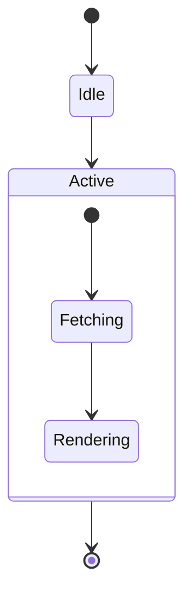
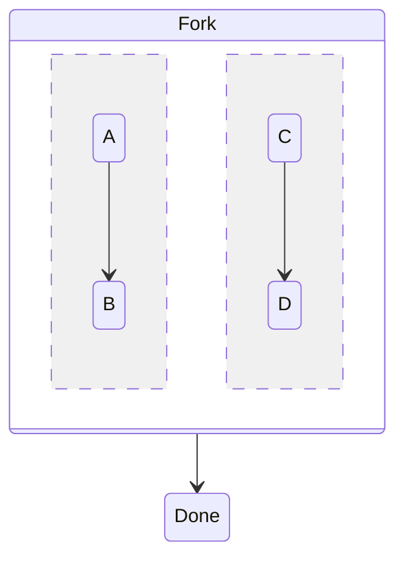
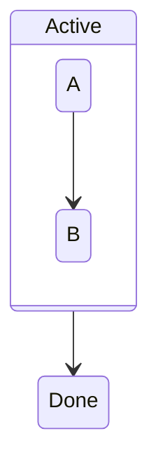

A composite state renders as a titled frame; the inner `[*]` is scoped to
the frame.



```text
       ╭───╮
       │ ● │
       ╰─┬─╯
         │
         ▼
     ╭──────╮
     │ Idle │
     ╰───┬──╯
         │
         ▼
┌ Active ────────┐
│      ╭───╮     │
│      │ ● │     │
│      ╰─┬─╯     │
│        │       │
│        ▼       │
│  ╭──────────╮  │
│  │ Fetching │  │
│  ╰─────┬────╯  │
│        │       │
│        ▼       │
│  ╭───────────╮ │
│  │ Rendering │ │
│  ╰───────────╯ │
└────────┬───────┘
         │
         ▼
       ╭───╮
       │ ● │
       ╰───╯
```

`--` splits a composite into unlabelled side-by-side regions.



```text
 ┌ Fork ───────────────────┐
 │ ┌────────┐   ┌────────┐ │
 │ │  ╭───╮ │   │  ╭───╮ │ │
 │ │  │ A │ │   │  │ C │ │ │
 │ │  ╰─┬─╯ │   │  ╰─┬─╯ │ │
 │ │    │   │   │    │   │ │
 │ │    ▼   │   │    ▼   │ │
 │ │  ╭───╮ │   │  ╭───╮ │ │
 │ │  │ B │ │   │  │ D │ │ │
 │ │  ╰───╯ │   │  ╰───╯ │ │
 │ └────────┘   └────────┘ │
 └────────────┬────────────┘
              │
              ▼
          ╭──────╮
          │ Done │
          ╰──────╯
```

A composite whose contents connect outward renders flat.



```text
┌ Active ┐
│  ╭───╮ │
│  │ A │ │
│  ╰─┬─╯ │
│    │   │
│    ▼   │
│  ╭───╮ │
│  │ B │ │
│  ╰───╯ │
└────┬───┘
     │
     ▼
 ╭──────╮
 │ Done │
 ╰──────╯
```
