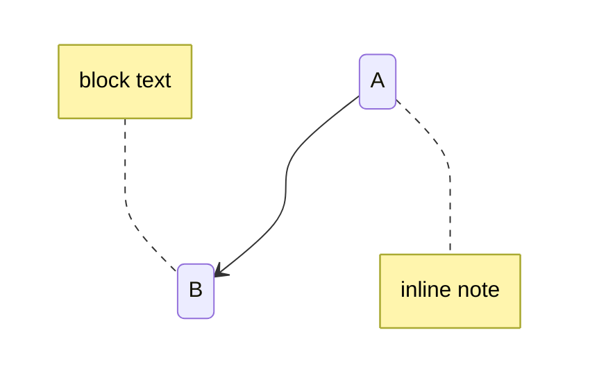

Notes, inline and block, are skipped.


```mermaid
stateDiagram-v2
  A --> B
  note right of A: inline note
  note left of B
    block text
  end note
```

```text
 ╭───╮
 │ A │
 ╰─┬─╯
   │
   ▼
 ╭───╮
 │ B │
 ╰───╯
```
