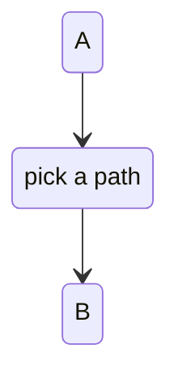
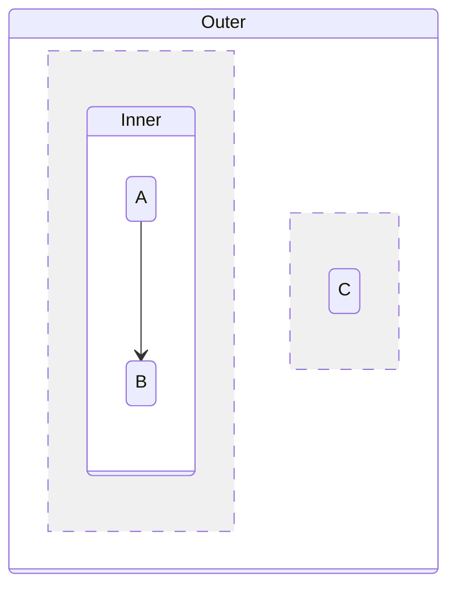
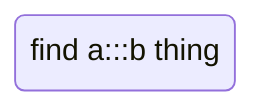
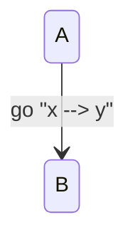

# State-diagram regressions

An extra dash in an arrow is tolerated.

```mermaid
stateDiagram-v2
  A ---> B
```

```text
 ╭───╮
 │ A │
 ╰─┬─╯
   │
   ▼
 ╭───╮
 │ B │
 ╰───╯
```

A description on a `<<choice>>` state keeps the diamond shape.



```text
      ╭───╮
      │ A │
      ╰─┬─╯
        │
        ▼
 ╔═════════════╗
 ║ pick a path ║
 ╚══════╤══════╝
        │
        ▼
      ╭───╮
      │ B │
      ╰───╯
```

The first `--` region divider reparents earlier members; the nested
composite must survive it.



```text
 ┌ Outer ────────────────┐
 │┌──────────┐           │
 ││ ┌ Inner ┐│           │
 ││ │ ╭───╮ ││           │
 ││ │ │ A │ ││   ┌──────┐│
 ││ │ ╰─┬─╯ ││   │ ╭───╮││
 ││ │   │   ││   │ │ C │││
 ││ │   ▼   ││   │ ╰───╯││
 ││ │ ╭───╮ ││   └──────┘│
 ││ │ │ B │ ││           │
 ││ │ ╰───╯ ││           │
 ││ └───────┘│           │
 │└──────────┘           │
 └───────────────────────┘
```

`:::` inside a quoted label is text, not a class tag.



```text
╭──────────────────╮
│ find a:::b thing │
╰──────────────────╯
```

After the label colon it is all label: an arrow inside the label text is
not another transition. Previously `y"` became a phantom state.



```text
 ╭───╮
 │ A │
 ╰─┬─╯
   │
   ▼go "x --> y"
 ╭───╮
 │ B │
 ╰───╯
```
